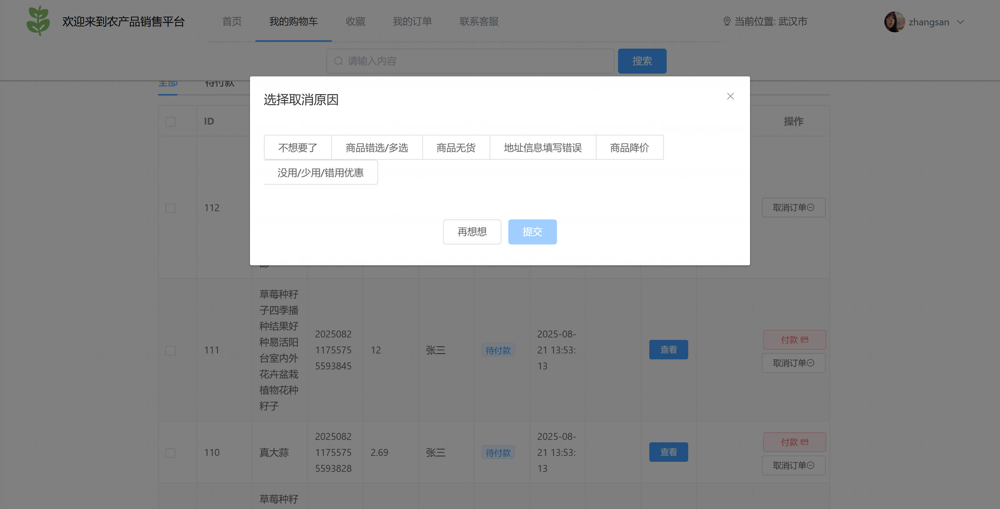
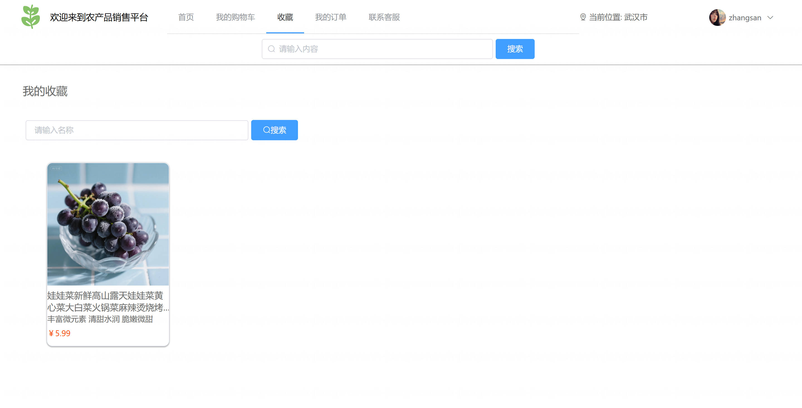
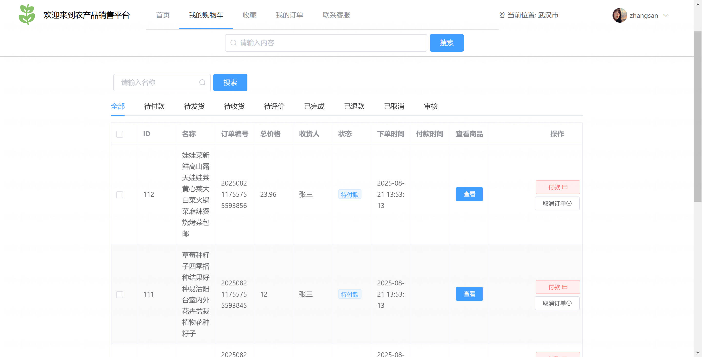
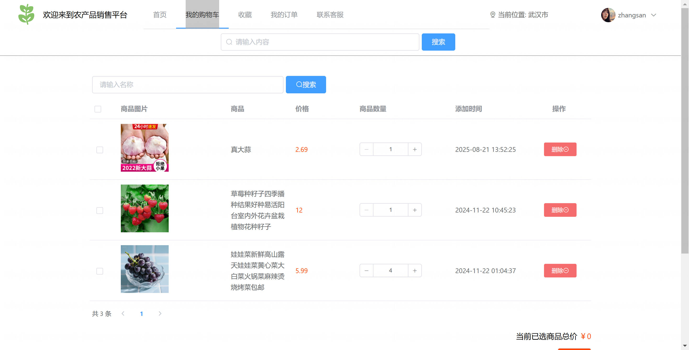
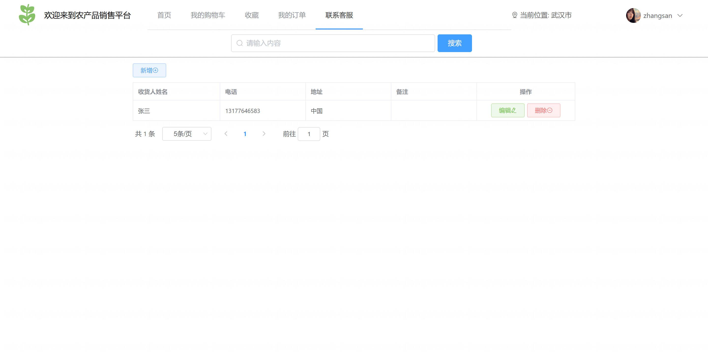
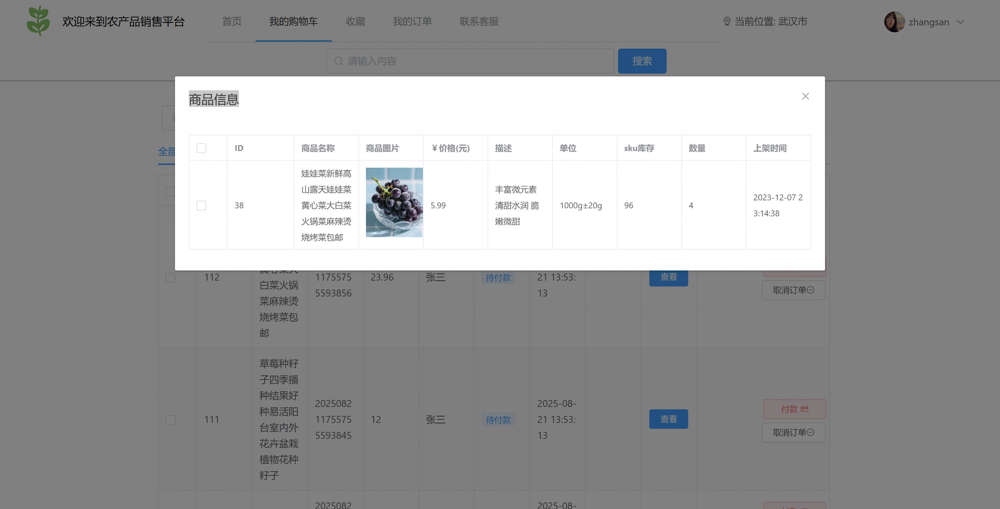
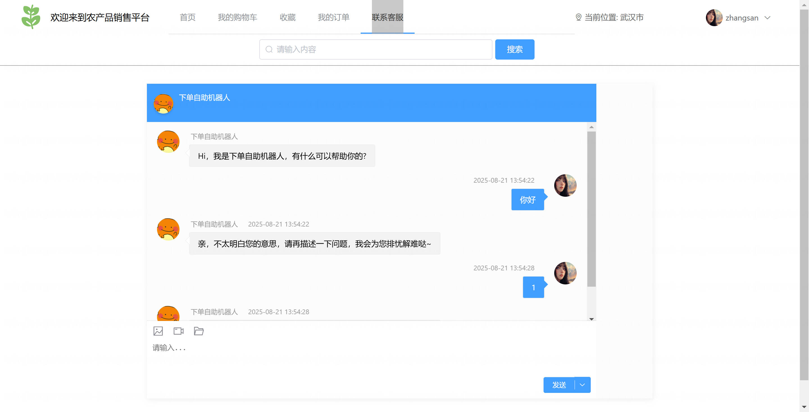
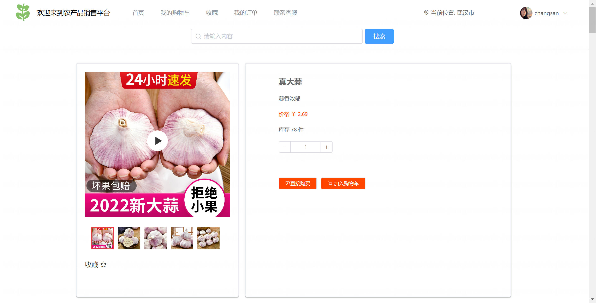
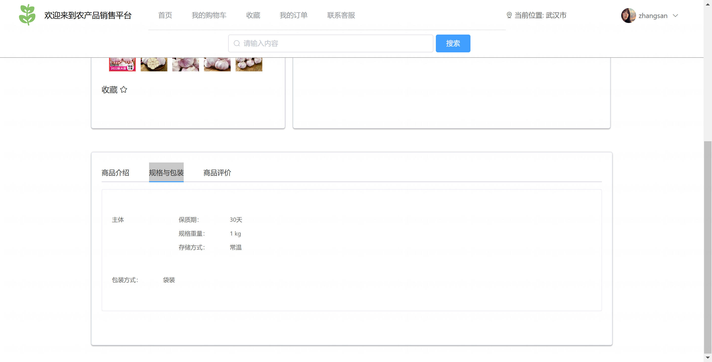

<h1 align="center">基于Spring Boot 的农产品销售系统系统【带论文】</h1>

- <b>完整代码获取地址：从戎源码网 ([https://armycodes.com/](https://armycodes.com/))</b>
- <b>技术探讨、资料分享，请加QQ群：692619798</b>
- <b>作者微信：19941326836  QQ：3645296857</b>
- <b>承接计算机毕业设计、Java毕业设计、Python毕业设计、深度学习、机器学习</b>
- <b>选题+开题报告+任务书+程序定制+安装调试+论文+答辩ppt 一条龙服务</b>
- <b>所有选题地址 ([https://github.com/Descartes007/allProject](https://github.com/Descartes007/allProject)) </b>

## 一、项目介绍

### 基于 Spring Boot 的农产品销售系统，系统角色主要为后台管理员（管理端）和前台用户（消费者），主要功能如下
### 后台管理员：
- 基本操作：登录、修改密码、获取与修改个人信息
### 用户管理：新增/编辑用户、删除/批量删除、分页查询、按用户名/邮箱/地址筛选、Excel 导入/导出、查看用户详情
### 角色与权限管理：新增/编辑角色、删除/批量删除、分页查询、配置角色菜单权限、查看角色权限
### 商品管理：新增/编辑商品、删除/批量删除、按分类/名称分页查询、设置商品参数、管理商品图片（上传/多图关联）、逻辑删除商品、商品批量操作
- 轮播图管理：上传轮播图、启用/停用、分页管理、逻辑删除、公开获取轮播图列表
- 订单管理：查看订单列表与详情、分页查询、按状态筛选、取消订单、订单审核、支付状态更新、发货操作、获取订单对应商品列表
- 文件管理：文件上传/下载、分页列表、删除/批量删除、文件信息更新
### 前台用户（消费者）：
- 基本操作：注册、登录、修改密码、查看/修改个人信息、获取当前用户信息
- 商品浏览：商品分页列表（按城市/名称）、商品详情、多图展示、商品参数查看、猜你喜欢/推荐列表、直播商品展示
- 购物与订单：加入购物流程（前端购物车）、直接购买或下单、订单结算、支付（更新订单状态）、查看个人订单列表与详情、取消订单、订单状态跟踪
- 收货地址：增删改查个人收货地址、分页查询当前用户地址
- 文件与上传：前端图片/文件上传（商品/轮播等）
- 交互与日志：用户访问日志记录（user-visit-log）、评价/评论等交互入口
- 多媒体/直播：视频播放与直播商品展示（集成 FLV/DPlayer/Video.js 等前端库）

## 二、项目技术

- 编程语言：Java（后端）、JavaScript/Vue（前端）
- 项目架构：B/S 架构（前端 Vue + 后端 Spring Boot）
- 前端技术：Vue 2、Vue Router、Vuex、Element UI、Avue（管理后台）、Axios、ECharts、视频/直播库（DPlayer、flv.js、video.js）、Vue CLI、Less
- 后端技术：Spring Boot、Spring Web、MyBatis-Plus（ORM 与分页）、JWT、Swagger（springfox）

## 三、运行环境

- JDK版本：1.8及以上都可以
- 操作系统：Windows7/10、MacOS
- 开发工具：IDEA、Ecplise、MyEclipse都可以

## 四、数据库配置文件

- npm版本：6.14.13及以上都可以
- Redis版本：3.2.100及以上都可以
- 文件名：application.yml
- 编码类型：utf8

## 论文截图

## 系统截图

